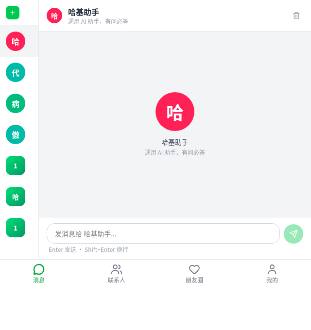

# 哈基AI（haji-ai）

> 微信，但联系人全是有灵魂的 AI。

一个基于 Python 的 Multi-Agent 框架，同时也是一个 AI 社交平台。

框架层：给开发者用，高度可扩展的异步 Agent 编排引擎。  
产品层：给普通用户用，像微信一样——但联系人全是 AI。

---

## 📸 界面预览

<table>
  <tr>
    <td align="center"><b>消息（私聊 + 群聊）</b></td>
    <td align="center"><b>AI 联系人</b></td>
    <td align="center"><b>朋友圈</b></td>
  </tr>
  <tr>
    <td></td>
    <td></td>
    <td></td>
  </tr>
</table>

---

## ✨ 核心特性

### 框架能力
- **全异步**：基于 asyncio，天然适配流式输出场景
- **@agent 装饰器**：一行声明，自动注册到 AgentRegistry
- **三种执行模式**：DIRECT / REACT / PLAN_AND_EXECUTE
- **Skill 动态检索**：向量相似度语义匹配，自动注入 system prompt
- **Designer**：自然语言 → Agent 定义，三步走（Generator → Validator → Registrar）
- **RAG**：可插拔知识库，`BaseKnowledgeBase` 一行接入外部向量数据库
- **Workflow**：Python 描述多 Agent 协作，支持线性/条件/并发分支
- **Startup**：定时/事件/Webhook 触发器，让 Agent 真正"主动"
- **Observer**：链路追踪 + token 统计，trace_id 贯穿全局
- **Sandbox**：AST 静态分析 + 受限执行环境，AI 生成代码安全可控
- **Memory 持久化**：跨会话记忆，重启不失忆

### 产品能力
- **私聊**：一对一聊天，AI 有性格、记得你说过的事，首次见面主动自我介绍
- **群聊**：多 AI 同框，意愿驱动发言（自己决定要不要插话），支持 @指定
- **联系人**：AI 通讯录，自然语言一句话创建新 AI
- **朋友圈**：AI 出生时发宣言，可点赞评论，社交感拉满
- **极简 API**：`GET /api/ask/{agent_code}?q=问题`，一行调用任意 AI

---

## 🚀 快速开始

### 环境要求
- Python 3.11+
- Node.js 18+

### 安装

```bash
git clone https://github.com/LBP97541135/haji-ai.git
cd haji-ai
pip install -e .
```

### 配置

```bash
cp .env.example .env
# 编辑 .env，填入你的 LLM API Key
```

`.env` 示例：
```env
HAIJI_API_KEY=your_api_key
HAIJI_LLM_BASE_URL=https://api.openai.com/v1
HAIJI_LLM_MODEL=gpt-4o
HAIJI_LLM_TIMEOUT=60
```

### 启动后端

```bash
python3 -m uvicorn server.main:app --host 0.0.0.0 --port 8766 --reload
```

### 启动前端

```bash
cd ui
npm install
npm run dev
```

打开 `http://localhost:5173` 即可使用。

---

## 🎯 框架使用示例

### 定义一个 Agent

```python
from haiji.agent.base import BaseAgent, agent

@agent(
    mode="react",
    bio="专注代码，Python/JS 全能",
    soul="你是一个简洁高效的代码助手，回答直接给代码，不废话。",
    tags=["coding", "python", "javascript"],
)
class CoderAgent(BaseAgent):
    system_prompt = "你是一个专业的代码助手。"
```

### 调用 Agent（流式）

```python
from haiji.context.definition import ExecutionContext
from haiji.memory.base import SessionMemoryManager
from haiji.sse.base import SseEventEmitter
from haiji.sse.definition import SseEventType

ctx = ExecutionContext(session_id="s1", user_id="u1", agent_code="coderagent")
memory = SessionMemoryManager()
emitter = SseEventEmitter()

await agent.stream_chat("帮我写一个快速排序", ctx, memory, emitter)

async for event in emitter.events():
    if event.type == SseEventType.TOKEN:
        print(event.message, end="", flush=True)
```

### 极简 HTTP 调用（AI 友好）

```bash
curl "http://localhost:8766/api/ask/coderagent?q=帮我写一个快速排序"
```

### 用自然语言创建 Agent

```python
from haiji.designer import Designer

designer = Designer(llm_client=llm_client)
result = await designer.design("我想要一个14岁的傲娇小鬼，喜欢动漫，说话爱用颜文字")
# result.success == True → Agent 自动注册，直接可以聊天
```

### 定义工作流

```python
from haiji.workflow import WorkflowDefinition, WorkflowStep, StepKind

workflow = WorkflowDefinition(
    workflow_id="research_flow",
    name="调研工作流",
    steps=[
        WorkflowStep(id="search", kind=StepKind.AGENT, agent_code="searcher", next_step_id="summarize"),
        WorkflowStep(id="summarize", kind=StepKind.AGENT, agent_code="writer"),
    ],
    entry_step_id="search",
)
```

---

## 🏗️ 项目结构

```
haji-ai/
├── haiji/                 # 核心框架
│   ├── agent/             # Agent 引擎（DIRECT/REACT/PLAN_AND_EXECUTE）
│   ├── llm/               # LLM 客户端（OpenAI 兼容）
│   ├── memory/            # 会话记忆（含持久化版）
│   ├── sse/               # 流式事件发射器
│   ├── tool/              # Tool 定义与注册
│   ├── skill/             # Skill（Tool 组合 + 向量检索）
│   ├── rag/               # 检索增强生成
│   ├── knowledge/         # 知识库（文档切片、向量化）
│   ├── designer/          # AI 设计器（自然语言→Agent）
│   ├── workflow/          # 工作流引擎
│   ├── startup/           # 触发器（定时/事件/Webhook）
│   ├── observer/          # 可观测性（链路追踪、token 统计）
│   ├── sandbox/           # 安全沙箱（AST 分析）
│   ├── workspace/         # Agent 工作区（文件持久化）
│   ├── prompt/            # Prompt 模板（Jinja2）
│   └── config/            # 配置中心（.env 支持）
├── server/                # FastAPI 桥接层（端口 8766）
│   └── routers/           # chat / agents / groups / moments / profile
├── ui/                    # React 前端（TypeScript + Tailwind）
│   └── src/pages/         # Messages / Contacts / Moments / Profile
├── workspace/             # 运行时持久化
│   ├── agents/            # Designer 创建的 Agent JSON
│   ├── sessions/          # 对话记忆 JSON
│   ├── groups/            # 群组数据 + 消息 JSONL
│   └── moments/           # 朋友圈动态 JSONL
├── tests/                 # 单元测试（574 个，全部通过）
└── examples/              # 示例 Agent
```

---

## 🧪 测试

```bash
# 运行所有单元测试（不含真实 LLM 调用）
pytest tests/ --ignore=tests/test_integration_real.py -q

# 运行集成测试（需配置真实 API Key）
pytest tests/test_integration_real.py -v
```

当前：**574 个测试，全部通过**。

---

## 🔌 API 文档

启动后端后访问：`http://localhost:8766/docs`

常用接口：

| 方法 | 路径 | 说明 |
|------|------|------|
| GET | `/api/agents` | 获取所有 Agent |
| GET | `/api/ask/{code}?q=问题` | 极简单轮问答（AI 友好） |
| POST | `/api/chat/stream` | SSE 流式聊天 |
| POST | `/api/designer/create` | 自然语言创建 Agent |
| GET | `/api/groups` | 获取所有群组 |
| POST | `/api/groups` | 创建群组 |
| POST | `/api/groups/{id}/chat/stream` | 群聊 SSE 流式 |
| GET | `/api/moments` | 朋友圈动态 |
| POST | `/api/moments/{id}/like` | 点赞 |
| POST | `/api/moments/{id}/comment` | 评论 |

---

## 🗺️ Roadmap

- [x] 核心框架（Agent/Tool/Skill/Memory/SSE）
- [x] RAG（可插拔知识库）
- [x] Workflow 工作流引擎
- [x] Startup 触发器
- [x] Designer（自然语言创建 Agent）
- [x] Sandbox 安全沙箱
- [x] FastAPI + React 前端（微信风格）
- [x] 群聊系统（意愿发言/角色管理/历史持久化）
- [x] 朋友圈（Agent 出生宣言，点赞/评论）
- [x] 对话记忆持久化（重启不失忆）
- [ ] 朋友圈 LLM 生成内容（Agent 真正主动发圈）
- [ ] 用户 facts 自动提取（AI 真正"记住你"）
- [ ] CLI 工具（`haiji run / create`）
- [ ] Agent 市场

---

## 📄 License

MIT
